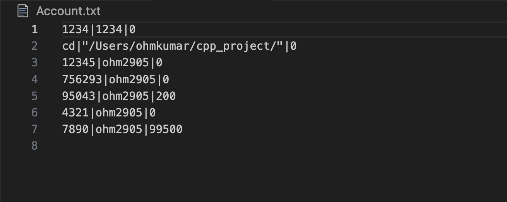
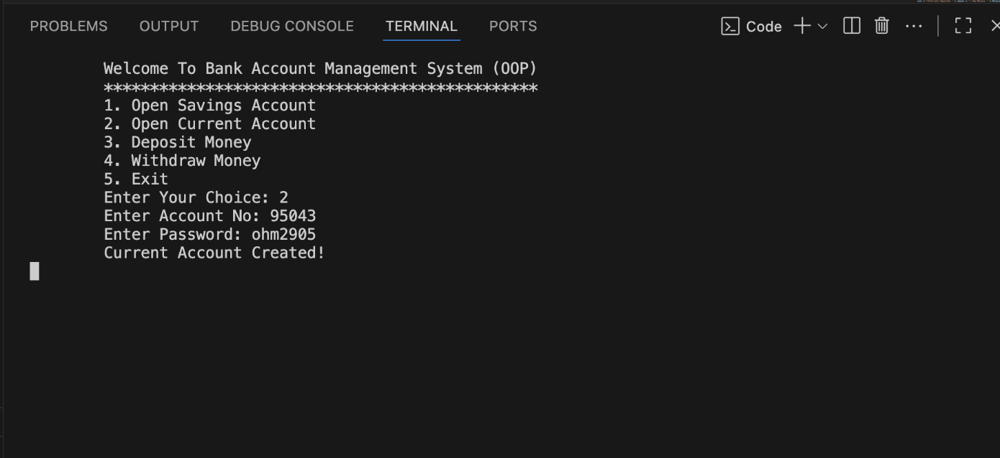
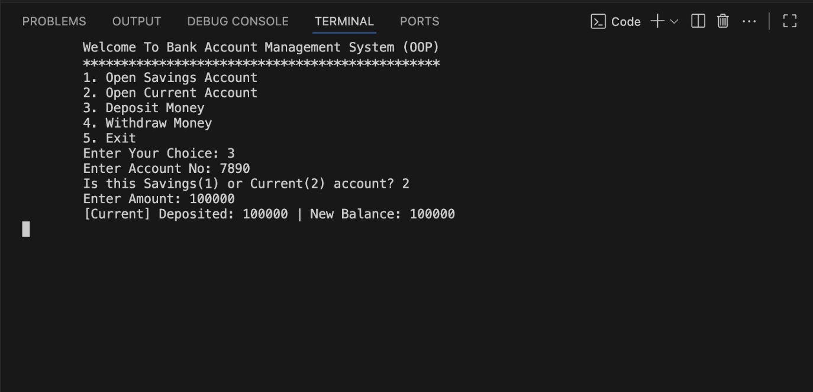
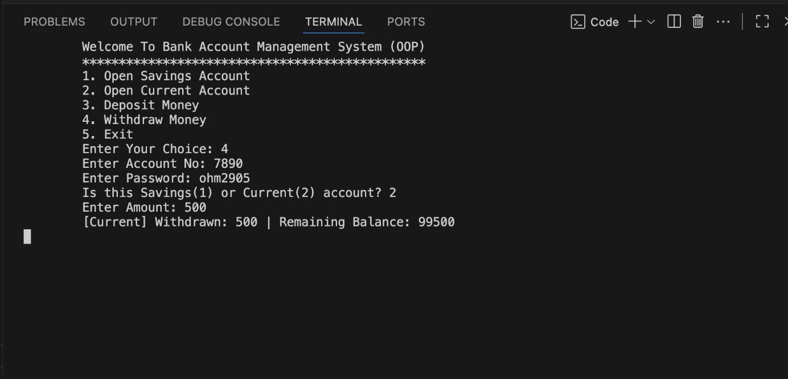
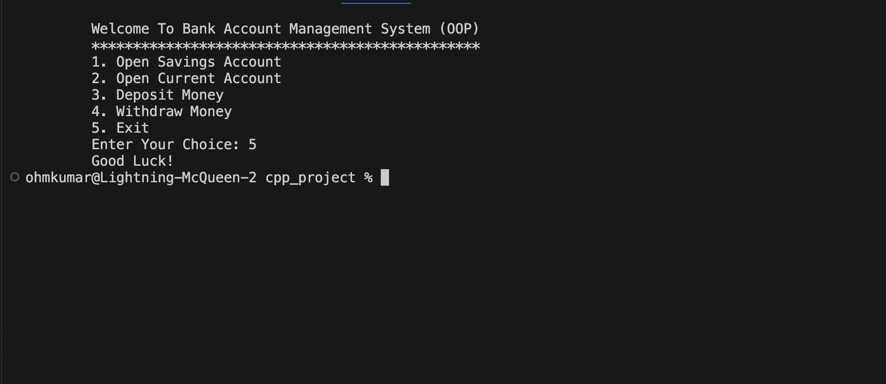

# 🏦 Bank Account Management System (C++)

This is a simple **Bank Account Management System** implemented in **C++ using OOP concepts and file handling**.  
The system allows users to create accounts, deposit and withdraw money, and manage account data securely using file storage.

---

## 📌 Features
- Create **Savings Account** or **Current Account**  
- Deposit money  
- Withdraw money (with overdraft protection for Current accounts)  
- Persistent storage using `Account.txt`  
- Password verification for withdrawals  
- Object-Oriented Design (Inheritance & Polymorphism)  

---

## 📂 Project Structure

## ⚙️ How to Run
1. Clone this repository:
   
   git clone <your-repo-url>
   cd <your-repo-folder>

2. Compile the program:

g++ BankSystem.cpp -o BankSystem

3. Run the program:

./BankSystem

Screenshot

Here’s a preview of the repository structure:

Concepts Used

Classes & Inheritance (SavingsAccount, CurrentAccount derived from Account)

Virtual Functions & Polymorphism (deposit & withdraw methods)

File Handling (ifstream, ofstream, stringstream)

Encapsulation (private data members with getters & setters)

Author

Ohm Kumar
B.Tech CSE | Aspiring Backend Developer

   
